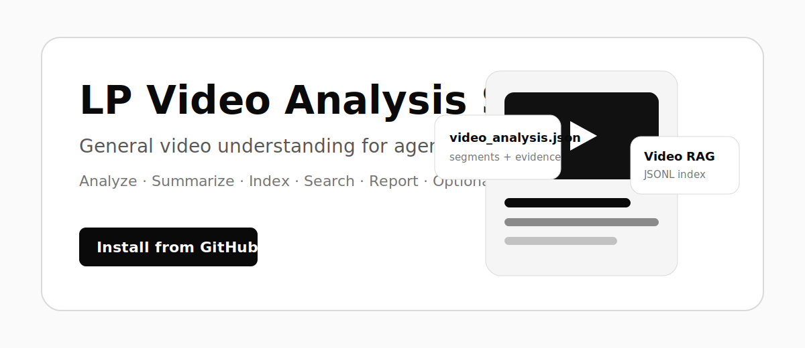

<div align="center">
  
  <h1>LP Video Analysis Skill</h1>
  <p><strong>A general video-understanding skill for agents: probe videos, extract audio and frames, build structured video analysis, and derive summaries, reports, Q&A context, search indexes, and optional clips.</strong></p>
  <p>
    <code>Codex</code> · <code>Claude Code</code> · <code>OpenClaw</code> · <code>Agent Skill</code> · <code>Video RAG</code>
  </p>
</div>

[Chinese README](README.zh-CN.md)

## What this project does

- Uses `ffprobe` to inspect video metadata.
- Uses `ffmpeg` to extract audio for ASR transcription.
- Samples frames at time intervals for visual understanding, OCR, and scene descriptions.
- Validates external ASR transcripts and frame observation files.
- Builds semantic segments automatically from transcripts, frame observations, and metadata.
- Defines a general `video_analysis.json` primary artifact.
- Configures ASR, VLM frame review, and OCR providers through `model_config.json`.
- Selects a first-pass review strategy automatically based on video length, scenario, and budget.
- Generates second-pass review plans for important segments.
- Runs dense frame extraction and local ASR/VLM/OCR only on selected windows to control multimodal token usage.
- Derives Markdown summaries, reports, `search_index.jsonl`, Q&A context, and optional clip plans from the analysis result.
- Optionally cuts clips, generates SRT subtitles, and builds a static review page.

This repository does not include a built-in video foundation model. ASR, visual descriptions, OCR, multimodal review, and structured JSON generation must be provided by your agent or model stack. This project standardizes the engineering workflow, input/output structure, automatic strategies, and second-pass review plans.

## Quick start

Install with npm:

```bash
npm install -g lp-video-analysis-skill
```

Use the installed CLI:

```bash
lp-video-analysis --help
lp-video-analysis init-analysis --output work/demo --scenario summary
```

You can also run from source. Clone the full repository, which includes `SKILL.md`, `scripts/`, `references/`, `assets/`, `agents/`, and `examples/`, then use `python3 scripts/video_understanding.py ...`.

Then hand a video to your agent and make a request such as:

```text
Use video-understanding-skill to analyze this video, create video_analysis.json, produce a summary, and build a search index.
```

## Core workflow

```text
video
 -> model_config.json configures ASR/VLM/OCR providers
 -> ffprobe metadata
 -> plan-analysis automatically selects a first-pass strategy
 -> run-asr generates or executes an ASR task
 -> sampled frames
 -> run-frame-review / run-ocr generates or executes VLM/OCR tasks
 -> build-segments
 -> video_analysis.json
 -> refine-plan automatically selects important windows
 -> execute-refine-plan dense frame extraction + local audio
 -> external ASR/VLM/OCR writes second-pass results
 -> merge-refine-results
 -> refined video_analysis.json
 -> summary / search index / report / Q&A / optional clips
```

For long videos, do not send the whole file to a strong multimodal model at once. A more stable workflow is to build a full-video timeline first with ASR and sparse frame sampling, then run dense multimodal review only on candidate windows.

## Common commands

If you installed the package globally with npm, you can replace `python3 scripts/video_understanding.py` in the commands below with `lp-video-analysis`.

Create an analysis workspace:

```bash
python3 scripts/video_understanding.py init-analysis --output work/demo --scenario summary
```

`init-analysis` also creates `model_config.json`. This is the model configuration layer. The default provider mode is `handoff`: scripts generate ASR/VLM/OCR request files and prompts, but do not pretend that model understanding has already happened. You can later switch providers to `command` mode to connect your own local ASR/VLM/OCR scripts. To rebuild the config separately, run:

```bash
python3 scripts/video_understanding.py init-model-config --output work/demo/model_config.json --language English
```

Probe video metadata:

```bash
python3 scripts/video_understanding.py probe examples/demo-input/original-product-video.mp4 --output work/demo/metadata.json
```

Choose a cost strategy automatically from metadata:

```bash
python3 scripts/video_understanding.py plan-analysis \
  --metadata work/demo/metadata.json \
  --scenario report \
  --budget standard \
  --output work/demo/analysis_strategy.json
```

Extract audio and sampled frames:

```bash
python3 scripts/video_understanding.py extract-audio input.mp4 --output work/demo/audio.wav
python3 scripts/video_understanding.py sample-frames input.mp4 --output-dir work/demo/frames --interval 30
```

Prepare or execute ASR through the model configuration layer:

```bash
python3 scripts/video_understanding.py run-asr \
  --config work/demo/model_config.json \
  --audio work/demo/audio.wav \
  --output work/demo/transcript.json \
  --language English
```

Validate model-generated transcripts and frame observations:

```bash
python3 scripts/video_understanding.py validate-transcript assets/sample_transcript.json
python3 scripts/video_understanding.py validate-frames assets/sample_frame_observations.json
```

Send sampled frames to a multimodal model for review, then ingest the model result:

```bash
python3 scripts/video_understanding.py prepare-frame-review \
  --frames-dir work/demo/frames \
  --interval 30 \
  --output work/demo/frame_review_manifest.json \
  --prompt-output work/demo/frame_review_prompt.md \
  --language English

python3 scripts/video_understanding.py run-frame-review \
  --config work/demo/model_config.json \
  --manifest work/demo/frame_review_manifest.json \
  --prompt work/demo/frame_review_prompt.md \
  --frames-dir work/demo/frames \
  --output work/demo/frame_review_output.json \
  --language English

# After the VLM writes work/demo/frame_review_output.json:
python3 scripts/video_understanding.py ingest-frame-review \
  --manifest work/demo/frame_review_manifest.json \
  --review work/demo/frame_review_output.json \
  --output work/demo/frame_observations.json
```

Build `video_analysis.json` from model outputs:

```bash
python3 scripts/video_understanding.py build-segments \
  --transcript assets/sample_transcript.json \
  --frames assets/sample_frame_observations.json \
  --metadata work/demo/metadata.json \
  --output work/demo/video_analysis.json \
  --scenario summary
```

Validate the general video analysis result:

```bash
python3 scripts/video_understanding.py validate-analysis assets/sample_video_analysis.json
```

Select candidate windows for second-pass review:

```bash
python3 scripts/video_understanding.py refine-plan \
  --analysis work/demo/video_analysis.json \
  --output work/demo/refine_plan.json
```

`refine-plan` marks windows as `P0`, `P1`, or `P2` according to rules such as high segment importance, high moment score, visual value, uncertainty keywords, audio without transcript, or unresolved questions. Later steps run dense frame extraction and local ASR/VLM/OCR only on those windows.

Prepare assets for selected second-pass windows:

```bash
python3 scripts/video_understanding.py execute-refine-plan input.mp4 \
  --plan work/demo/refine_plan.json \
  --output-dir work/demo/refine \
  --priorities P0,P1
```

Each selected window receives dense `frames/`, `audio.wav` when ASR is needed, `frame_review_manifest.json`, `frame_review_prompt.md`, and `window.json`. After ASR and VLM/OCR results are written into the window directories, merge them back into the primary analysis:

```bash
python3 scripts/video_understanding.py merge-refine-results \
  --analysis work/demo/video_analysis.json \
  --execution-manifest work/demo/refine/refine_execution_manifest.json \
  --normalize-outputs \
  --output work/demo/video_analysis.refined.json
```

Derive summaries, search indexes, and optional clip plans:

```bash
python3 scripts/video_understanding.py summary --analysis assets/sample_video_analysis.json --output work/demo/summary.md
python3 scripts/video_understanding.py search-index --analysis assets/sample_video_analysis.json --output work/demo/search_index.jsonl
python3 scripts/video_understanding.py derive-clips --analysis assets/sample_video_analysis.json --output work/demo/clip_plan.json
```

Optional: cut clips and generate a review page:

```bash
python3 scripts/video_understanding.py cut examples/demo-input/original-product-video.mp4 --plan work/demo/clip_plan.json --output-dir work/demo/clips
python3 scripts/video_understanding.py page --plan work/demo/clip_plan.json --clips-dir work/demo/clips --source-video examples/demo-input/original-product-video.mp4 --copy-media --output work/demo/site/index.html
```

The legacy entry point `scripts/video_highlight.py` is still kept, but only as a compatibility wrapper that forwards to `video_understanding.py`.

## Output structure

Primary artifact:

```text
video_analysis.json
```

Common derived artifacts:

```text
summary.md
search_index.jsonl
optional: clip_plan.json
optional: clips/*.mp4
optional: clips/*.srt
optional: site/index.html
```

References:

- [references/video-analysis-schema.md](references/video-analysis-schema.md): general video understanding schema.
- [references/model-config-schema.md](references/model-config-schema.md): ASR/VLM/OCR model configuration schema.
- [references/analysis-schema.md](references/analysis-schema.md): optional clip plan schema.

## Recommended video-understanding architecture

```text
video
 -> ffprobe metadata
 -> plan-analysis
 -> ASR transcript with timestamps
 -> sampled frames
 -> VLM frame review + OCR
 -> build-segments
 -> video_analysis.json
 -> refine-plan
 -> dense candidate-window review
 -> refined video_analysis.json
 -> summary / search index / report / Q&A
 -> optional selected moments and ffmpeg clips
```

For long videos, avoid sending the full file to a strong multimodal model in a single pass. The more robust approach is to build a timeline with ASR and sparse frame sampling first, then run multimodal review only on candidate segments.

The model handoff layer is explicit:

```text
frames/*.jpg
 -> prepare-frame-review
 -> frame_review_manifest.json + frame_review_prompt.md
 -> external VLM/OCR model
 -> frame_review_output.json
 -> ingest-frame-review
 -> frame_observations.json
```

Second-pass review is also represented as explicit artifacts:

```text
video_analysis.json
 -> refine-plan
 -> refine_plan.json
 -> execute-refine-plan
 -> per-window dense frames + local audio + frame review prompts
 -> external ASR/VLM/OCR outputs
 -> merge-refine-results
 -> refined video_analysis.json
```

## Evaluation fixtures

Golden evaluation fixtures live in `examples/eval/`. They do not call ASR, OCR, VLM, `ffmpeg`, or `ffprobe`; they only validate stable engineering contracts:

```bash
python3 scripts/evaluate_fixtures.py
```

Each fixture includes `manifest.json`, stable metadata, transcript, frame observations, and a manually confirmed `expected_video_analysis.json`. When you have real business videos, add new cases using the same directory structure.

## Requirements

- Python 3.9+
- `ffmpeg`
- `ffprobe`
- An agent or model stack that can provide ASR and multimodal understanding

## License

MIT. See [LICENSE](LICENSE).

## Relationship to the original project

This repository is adapted from [inhai-wiki/video-highlight-skill](https://github.com/inhai-wiki/video-highlight-skill). The original project is released under the MIT License, which allows copying, modification, publication, and relicensing. We keep the MIT License and preserve the original author contributions in the Git history.

We reused these parts of the original project:

- Agent Skill organization: `SKILL.md`, `scripts/`, `references/`, `assets/`, `agents/`, and `examples/`.
- Deterministic media-processing workflow: `ffprobe` probing, `ffmpeg` audio extraction, frame extraction, clipping, SRT subtitle generation, and static page generation.
- The original optional clip plan structure and demo media-processing workflow.

We changed and added these parts:

- Repositioned the project from "highlight clipping first" to "general video understanding first".
- Added `video_analysis.json` as the primary artifact.
- Added [references/video-analysis-schema.md](references/video-analysis-schema.md).
- Added [scripts/video_understanding.py](scripts/video_understanding.py), with commands such as `init-analysis`, `validate-analysis`, `validate-transcript`, `validate-frames`, `build-segments`, `summary`, `search-index`, and `derive-clips`.
- Added explicit transcript/frame observation input contracts, VLM frame-review handoff commands, the primary `moments` field, and JSONL output better suited for Video RAG.
- Kept [scripts/video_highlight.py](scripts/video_highlight.py) as a compatibility wrapper.
- Replaced the original highlight-clipping hero brand image with the LP Video Analysis cover.
- Added [assets/sample_video_analysis.json](assets/sample_video_analysis.json).
- Added basic unit tests.